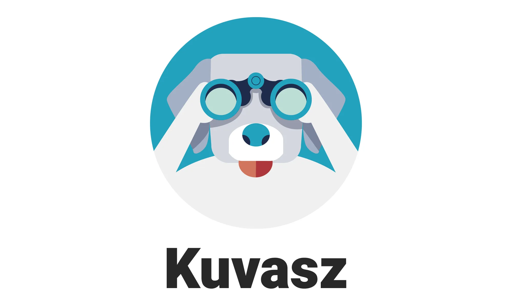
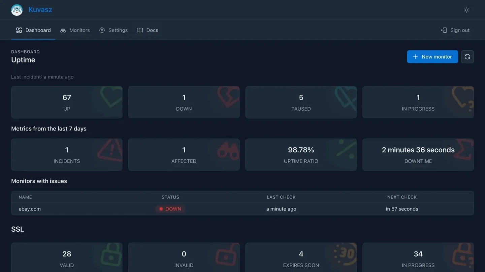

---

## [Documentation](https://kuvasz-uptime.dev)

## ℹ️  What is Kuvasz?

**Kuvasz** [ˈkuvɒs], an open-source, self-hosted uptime & SSL monitoring service, designed to help you keep track of your websites and services. It provides a modern, user-friendly interface, a powerful REST API, and supports multiple notification channels like email, Slack, Telegram, and PagerDuty.

### Where does the name come from?

Kuvasz (pronounce as [ˈkuvɒs]) is an ancient hungarian breed of livestock & guard dog. You can read more about them on [Wikipedia](https://en.wikipedia.org/wiki/Kuvasz).

## ✨ Features

- **HTTP(S) monitoring**: Monitor the availability and performance of your websites and services by sending HTTP(S) requests.
- **SSL certification monitoring**: Automatically check the SSL certificates of your monitored services to ensure they are valid and not expired.
- **Notifications on a per-monitor basis**: Configure different notification channels for each monitor, allowing you to tailor alerts to your specific needs.
- **Sleek UI**: Kuvasz has a modern, responsive, and user-friendly interface that makes it easy to manage your monitors.
- **Full-fledged REST API**: Manage your monitors, check their status, and more through a powerful API.
- More to come: _Kuvasz_ is under active development, and more features are planned for the future, such as **response keyword matching**, **POST requests with arbitrary payload**, and more.

## ⚡️  Quick start guide

If you want to get started quickly, please refer to the [**Installation guide**](https://kuvasz-uptime.dev/setup/installation/) in the documentation.

## ☕️ Do you like it?

While _Kuvasz_ is free and open-source, it still requires a lot of time and effort to maintain and develop. If you like it, please consider supporting the project by **starring it on GitHub**, or by **donating** via Ko-fi:

## ⁉️ Do you have a question?

Let's go to the [discussions](https://github.com/kuvasz-uptime/kuvasz/discussions)!
