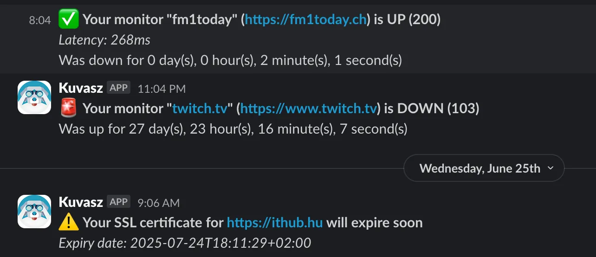
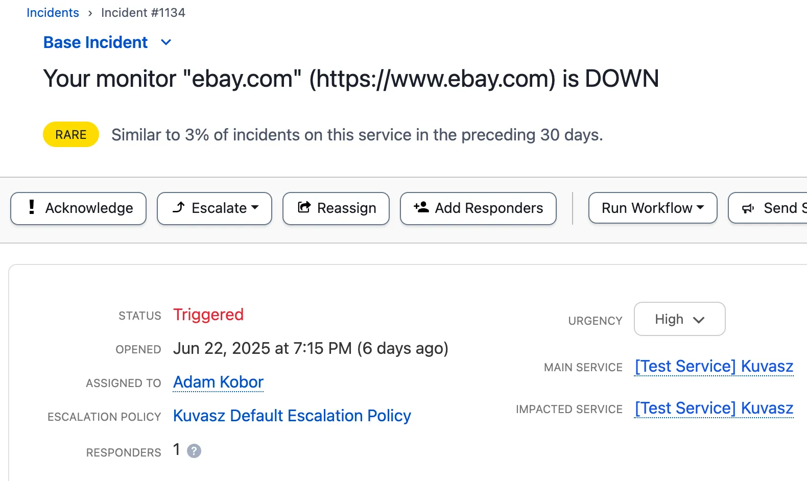
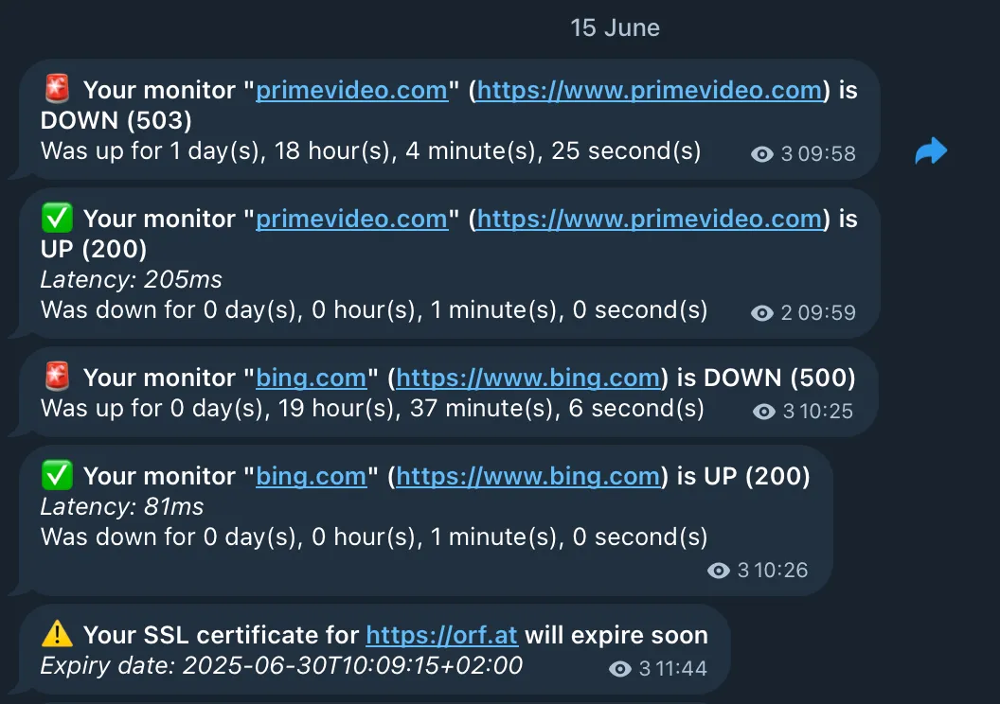

_Kuvasz_ supports a variety of integrations to help you **stay informed** about the status of your monitors. If you're curious about the configuration options, just click on the <!-- md:config --> icon, next to the integration name, and it will take you to the relevant section of the configuration documentation.

!!! info 
  
    Integrations can be:
    
    - **global**, meaning that they can be used for all monitors by default, or
    - assigned to **specific monitors**.

    You can also configure **multiple integrations of the same type**, for example, multiple Slack channels, or multiple email addresses to notify.

## Watched events

Every integration **watches a set of events**, which are fired by the monitors. These events are currently the following:

### Uptime events

| Event  | Description                                                         |
|--------|---------------------------------------------------------------------|
| `UP`   | Fired, when a monitor is **healthy** now (and it was `DOWN` before) |
| `DOWN` | Fired, when a monitors is **unhealthy**                             |

### SSL events

| Event         | Description                                                                                         |
|---------------|-----------------------------------------------------------------------------------------------------|
| `VALID`       | Fired, when an SSL certificate is **valid** now (and it was `INVALID` or `WILL_EXPIRE` before)      |
| `INVALID`     | Fired, when an SSL certificate is **invalid or expired** now                                        |
| `WILL_EXPIRE` | Fired, when an SSL certificate **will expire in the next X days** (`X` is configurable per monitor) |

## Slack <!-- md:config ../setup/integrations.md#slack -->

You can set up
_Slack_ as a notification channel for your monitors. This allows you to receive notifications about the status of your monitors directly in your Slack channels.

## Discord <!-- md:config ../setup/integrations.md#discord -->

The _Discord_ integration allows you to send notifications **to Discord channels**. This allows you to receive notifications about the status of your monitors directly in your Discord channels.

## Email <!-- md:config ../setup/integrations.md#email -->

The email integration lets you to configure an _SMTP_ connection, with which
_Kuvasz_ can send you simple email notifications about the status of your monitors.

## PagerDuty <!-- md:config ../setup/integrations.md#pagerduty -->

The _PagerDuty_ integration allows you to trigger **incidents in PagerDuty** when a monitor goes down or an SSL certificate is invalid or will expire soon. This way, you can ensure that your team is notified immediately about critical issues. Incidents will be **automatically resolved** when the monitor is back up or the SSL certificate is valid again.

## Telegram <!-- md:config ../setup/integrations.md#telegram -->

The _Telegram_ integration allows you to send notifications **to a specific Telegram chat** via the Bot API. You can use it to receive notifications about the status of your monitors **directly in your Telegram app**.

## Coming soon...

- Grafana IRM
- Microsoft Teams
- Sendable test notifications (e.g. to test if the integration is working)

!!! tip "Do you miss an integration?"

    If you **miss an integration**, please [open an issue](https://github.com/kuvasz-uptime/kuvasz/issues/new?template=feature_request.md){target="_blank"}, or consider contributing it yourself! We are always open to new integrations and **would love to see your contribution**.
