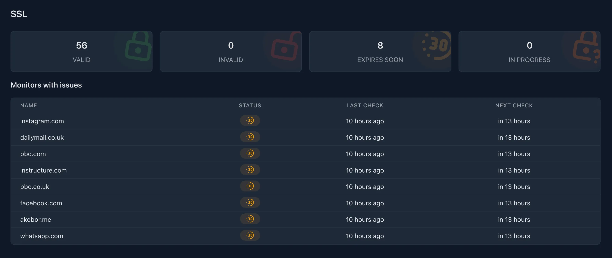

Monitoring your SSL/TLS certificates is crucial to ensure that your services **remain secure and operational**. This feature allows you to **monitor the expiration dates** of your certificates and receive alerts when they are nearing expiration.

## How does it work?

Kuvasz checks your SSL/TLS certificates **every day and notifies** you before they expire. You can configure the notification channels on a per-monitor basis, and you can also **set the days before expiration** when you want to be notified.

## Configuration <!-- md:config ../setup/managing-monitors.md -->

Please refer to the [**Managing monitors**](../setup/managing-monitors.md) section of the documentation for more information on how to configure SSL monitoring.
