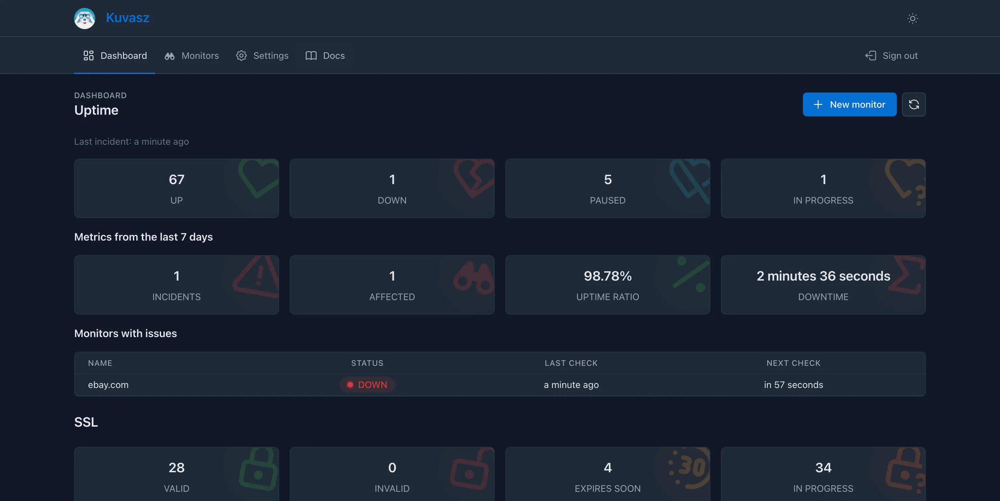
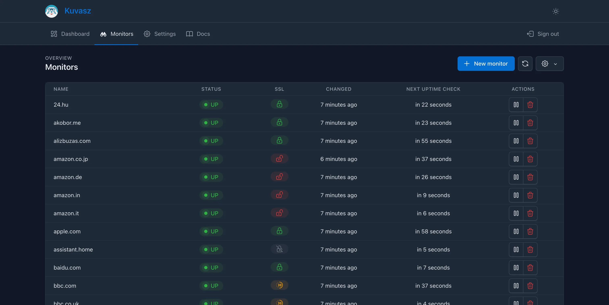
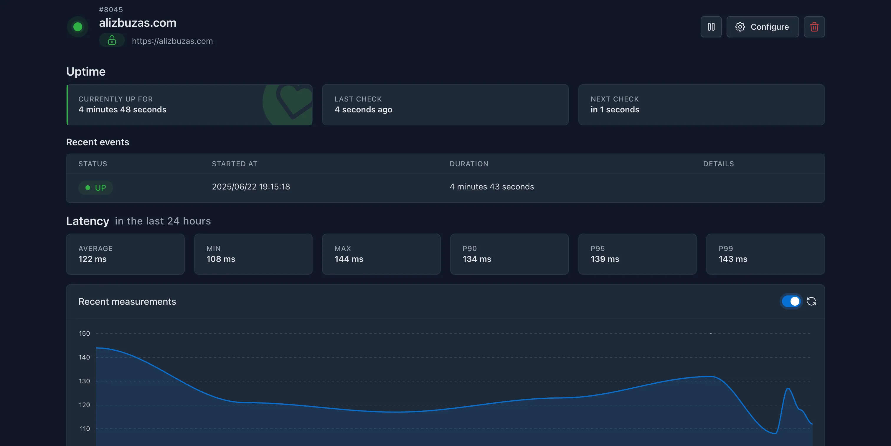
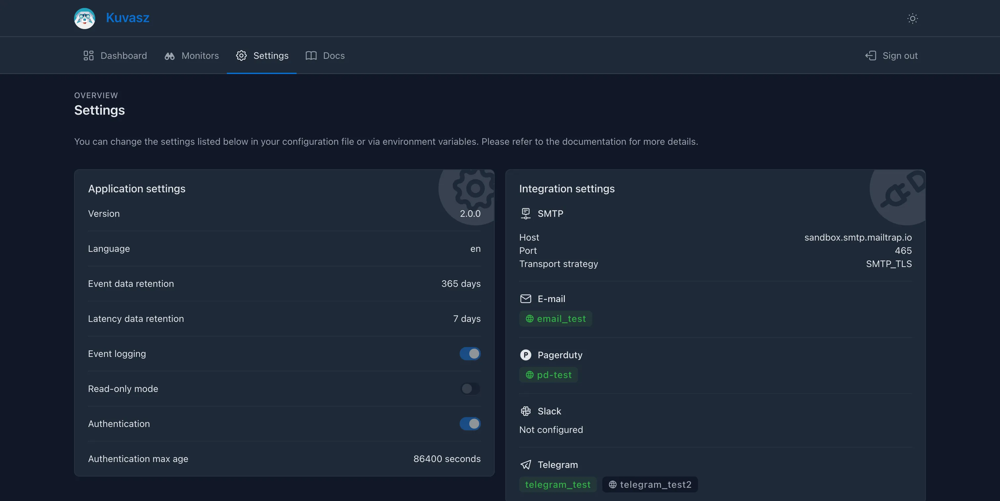

_Kuvasz_ provides a sleek and performant user interface that allows you to **manage your monitors**, view their status, and **access detailed information** about each monitor. The UI is designed to be intuitive and easy to use, making it simple to navigate through your monitoring setup.

- **NO** complex, bloated frontend frameworks
- **NO** unnecessary dependencies

Just a **clean and responsive interface** that works well on both desktop and mobile devices!

