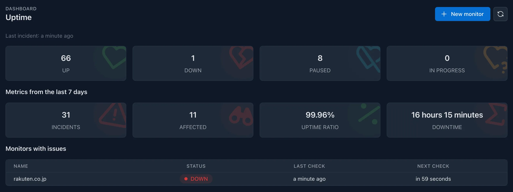

Uptime monitoring is a crucial feature that allows you to keep track of the **availability and performance** of your websites and services. It helps you ensure that your applications are running smoothly and **alerts you** when they are down or experiencing issues, which is essential for maintaining a reliable user experience.

## How does it work?

_Kuvasz_ monitors your websites and services by **periodically sending requests** to them. It checks the response status codes (should be `2xx`), response times (should respond in 30 seconds), and other metrics to determine if the service is up and running. If a service is down or not responding as expected, Kuvasz will **notify you** through your configured notification channels.

### What can be configured?

- interval for uptime checks
- HTTP method (`GET` or `HEAD` as of now)
- URL to monitor
- whether to follow redirects
- whether to send a no-cache header

### What is planned to be configurable in the future?

- response status codes (currently only `2xx` are considered healthy) 
- response time (currently requests should respond in 30 seconds)
- custom request headers (currently no custom headers are sent), which makes it possible for example, to use common authentication methods against your monitored endpoints, or a custom user agent
- response keyword matching (e.g. to check if a specific string is present in the response body)
- custom request payload (e.g. to send a `POST` request with a specific payload)

## Notable features

- **HTTP(S) monitoring**: Monitor the availability and performance of your websites and services by sending HTTP(S) requests.
- **Response time tracking**: Track the latency of your services by measuring the time it takes to receive a response from them.
- **Notifications on a per-monitor basis**: Configure different notification channels for each monitor, allowing you to tailor alerts to your specific needs.
- More to come: _Kuvasz_ is under active development, and more features are planned for the future, such as **response keyword matching**, **POST requests with arbitrary payload**, and more.

## Configuration <!-- md:config ../setup/managing-monitors.md -->

Please refer to the [**Managing monitors**](../setup/managing-monitors.md) section of the documentation for more information on how to configure uptime monitoring.
