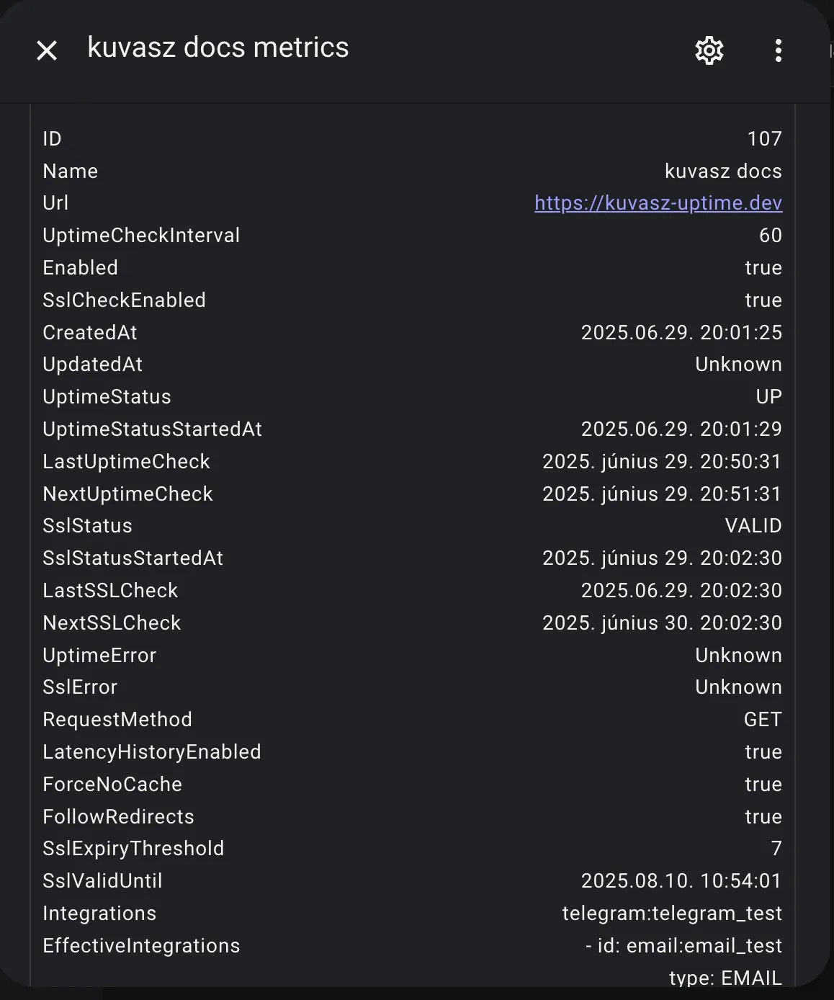
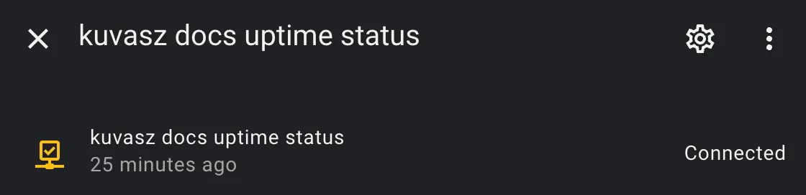

## Enable trace logging of HTTP requests/responses

If you want to **debug one of your monitors**, you can enable trace logging of HTTP requests and responses. This will log all the requests and responses made by _Kuvasz_ to  your monitors. All you need to do is to add the following configuration to your _YAML_ configuration file:

```yaml
logger:
  levels:
    io.micronaut.http.client: TRACE # (1)!
```

1. You can also use `DEBUG`, but it won't log the request and response bodies, only the headers and status codes.

## Home Assistant RESTful integration

_Kuvasz_ can be easily **integrated with Home Assistant** using the [_RESTful_](https://www.home-assistant.io/integrations/rest/){target="_blank"} integration by using its [API](../features/api.md). This allows you to create sensors for your most precious monitors and use them in your **automations, scripts**, or just to visualize the status of your monitors. You can even **build your own custom dashboard** with the data from your monitors!

!!! tip

    If you have the [authentication disabled](configuration.md#toggling-authentication), you can skip setting up your API key as a secret and you can also omit the `X-API-KEY` header in your requests.

### Define your secret in Home Assistant

```yaml title="secrets.yaml"
kuvasz_api_key: "ThisShouldBeVeryVerySecure"
```

### Sensor with JSON attributes

```yaml title="configuration.yaml"
sensor:
  - name: "kuvasz docs metrics"
    unique_id: metrics_kuvasz_docs
    platform: rest
    verify_ssl: false
    scan_interval: 60
    resource: http://kuvasz.home/api/v1/monitors/107
    headers:
      X-API-KEY: !secret kuvasz_api_key
    value_template: "OK"
    json_attributes:
      - id
      - name
      - url
      - uptimeCheckInterval
      - enabled
      - sslCheckEnabled
      - createdAt
      - updatedAt
      - uptimeStatus
      - uptimeStatusStartedAt
      - lastUptimeCheck
      - nextUptimeCheck
      - sslStatus
      - sslStatusStartedAt
      - lastSSLCheck
      - nextSSLCheck
      - uptimeError
      - sslError
      - requestMethod
      - latencyHistoryEnabled
      - forceNoCache
      - followRedirects
      - sslExpiryThreshold
      - sslValidUntil
      - integrations
      - effectiveIntegrations
```

**Result:**



### Binary sensor for uptime as `connectivity`

```yaml
binary_sensor:
  - name: "kuvasz docs uptime status"
    unique_id: uptime_kuvasz_docs
    platform: rest
    verify_ssl: false
    scan_interval: 60
    resource: http://kuvasz.home/api/v1/monitors/107
    headers:
      X-API-KEY: !secret kuvasz_api_key
    device_class: connectivity
    value_template: >
      
      {{ status == 'UP' }}
    availability: >
      {{ value_json.uptimeStatus is not none }}
```

**Result:**



## Full YAML example (app-config + monitors + integrations)

This is just a full example of a _YAML_ configuration file, which you can use as a **starting point** for your own configuration. You can copy and paste it into your own configuration file, and then modify it to suit your needs, but always make sure that **you read the corresponding documentation** sections for each feature or integration you want to use.

!!! warning

    Be aware that if you define your monitors via _YAML_, you **cannot use the Web UI** to modify them, you can only view them there!

```yaml
micronaut.security.enabled: true
micronaut.security.token.generator.access-token.expiration: 86400 # 24 hours
admin-auth:
  username: YourSuperSecretUsername
  password: YourSuperSecretPassword
  api-key: ThisShouldBeVeryVerySecureToo
app-config:
  event-data-retention-days: 365
  latency-data-retention-days: 7
  log-event-handler: true
  language: en
---
smtp-config:
  host: 'your.smtp.server'
  port: 465
  transport-strategy: SMTP_TLS
  username: YourSMTPUsername
  password: YourSMTPPassword
---
integrations:
  pagerduty:
    - name: pd_global
      integration-key: YourOwnIntegrationKey
      global: true
      enabled: true
  slack:
    - name: slack_default
      webhook-url: 'https://hooks.slack.com/services/T00000000/B00000000/XXXXXXXXXXXXXXXX'
  discord:
    - name: discord
      webhook-url: https://discord.com/api/webhooks/XXXXXXX/YYYYYYYYY
  email:
    - name: email_implicitly_enabled
      from-address: noreply@kuvasz-uptime.dev
      to-address: your@email.address
  telegram:
    - name: telegram_disabled
      api-token: 'YourToken'
      chat-id: '-1232642423121'
      enabled: false
---
monitors:
  - name: "full configuration example"
    url: "https://akobor.me"
    uptime-check-interval: 30
    enabled: true
    ssl-check-enabled: false
    request-method: "GET"
    latency-history-enabled: true
    follow-redirects: true
    force-no-cache: true
    ssl-expiry-threshold: 30
    integrations:
      - "telegram:telegram_disabled"
      - "slack:slack_default"
  - name: "minimal configuration example"
    url: "https://kuvasz-uptime.dev"
    uptime-check-interval: 5
```
