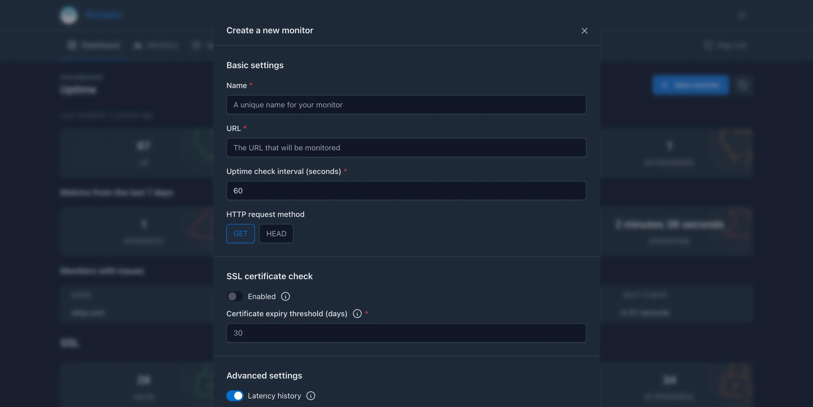

There are three ways to manage your monitors in _Kuvasz_: through the **Web UI**, using a **YAML configuration file**, or via the **REST API**. Each method has its own advantages, and you can choose the one that best fits your workflow.

!!!note "Key concepts for all methods"

    - The **name of the monitor must be unique**, otherwise the creation/update will fail. If you want to update an existing monitor, you can use the same name, of course.
    - The UI and the API will be in **read-only mode** if you have defined your monitors via _YAML_

## Management methods

=== "Web UI (recommended)"

    The Web UI should be intuitive and user-friendly enough to make it straightforward to create, edit, and manage your monitors. You can access the UI by **navigating to the root of your _Kuvasz_ instance** (e.g. `http://0.0.0.0:8080` if you're running it with the default port setup).

    

=== "YAML (more advanced)"

    !!!info "Consequences of describing your monitors as YAML"

        Be aware that if you define your monitors via _YAML_, you **cannot use the UI, or the API** to modify them, you can only view them there (read-only operations are permitted)!
    
        In this case _Kuvasz_ reads your YAML file on startup, compares the monitors in there with the existing ones in the database, and uses the YAML file as the source of truth. 
    
        The same applies if you **used the UI or the API before** to manage your monitors, and you decide to switch to YAML: unless your YAML definition matches the existing monitors by their name, existing monitors **could be deleted or modified**.

    **What happens if you add one or more monitor to your YAML file?**

    - If there is a monitor in the database that is not in the YAML file, **it will be deleted**.
    - If there is a monitor in the YAML file that is not in the database, **it will be created** and added to the database.
    - If there is a monitor in both the YAML file and the database, and they have the same name, the monitor in the database **will be updated** with the values from the YAML file.

    **What happens if you remove all of your monitors from the YAML file?**

    All monitors in the database **will be kept** (i.e. the ones that were created before via YAML). This is especially useful if you want to **restore your monitors from your exported YAML backup**, but you want to manage them on the UI in the future.

    Vice versa: Another typical use case is when you want to manage your monitors via YAML, but you want to **set them up initially via the UI or the API**. In this case, you can export all your monitors to a YAML file, and then **copy the content** of that file into your own configuration file.

    !!!danger "Changing a monitor's name"

        **If you change the name** of an existing monitor in the YAML file, it will be treated as a new monitor, and the old one will be deleted. This also means that all of your previously recorded events and metrics (i.e. latency history, uptime checks, etc.) **will be lost for that monitor**.

    ```yaml title="YAML monitor reference"
    monitors:
    - name: "My Monitor" # (1)!
      url: "https://kuvasz-uptime.dev" # (2)!
      uptime-check-interval: 60 # (3)!
      enabled: true # (4)!
      ssl-check-enabled: false # (5)!
      latency-history-enabled: true # (6)!
      request-method: "GET" # (7)!
      follow-redirects: true # (8)!
      force-no-cache: true # (9)!
      ssl-expiry-threshold: 30 # (10)!
      integrations: # (11)!
        - "email:my-email-integration"
    # ... other monitors
    ```

    1. **Name**: The name of the monitor, which must be unique.
    2. **URL**: The URL of the monitor, which is the endpoint that will be monitored.
    3. **Uptime check interval**: The interval in seconds at which the uptime checks will be performed. The **minimum value is 5 seconds**.
    4. **Enabled**: Whether the monitor is enabled or not. If it's disabled, it won't be checked, and no events will be recorded for it.
    5. **SSL check enabled**: Whether the SSL check is enabled or not. If it's disabled, the monitor won't check the SSL certificate.
    6. **Latency history enabled**: Whether the latency history is enabled or not. If it's disabled, the monitor won't record latency history.
    7. **Request method**: The HTTP method to use for the uptime checks (e.g. GET, HEAD, etc.). Defaults to GET.
    8. **Follow redirects**: Whether the monitor should follow redirects or not. Defaults to true.
    9. **Force no cache**: Whether the monitor should send a `Cache-Control: no-cache` header with the request. Defaults to true.
    10. **SSL expiry threshold**: The number of days before the SSL certificate expires that the monitor should alert about it. Defaults to 30 days.
    11. **Integrations**: A list of integrations to assign to the monitor. The format is `"{integration-type}:{integration-name}"`, where `integration-type` is the type of the integration (e.g. `email`, `slack`, etc.), and `integration-name` is the name of the integration as defined in the `integrations` section of your YAML file. Example: `email:my-email-integration`.

=== "API (expert)"

    This section won't go into details about the API or about exact API calls, since it's **well documented and must be self-explanatory**. You can find more information about the available endpoints and their usage in the [**API documentation**](../api-docs.md).

    However, here are **few of the most important** endpoints:

    - `GET /api/v1/monitors` – List all monitors
    - `GET /api/v1/monitors/{id}` – Get a specific monitor by its ID
    - `POST /api/v1/monitors` – Create a new monitor
    - `PATCH /api/v1/monitors/{id}` – Update an existing monitor
    - `DELETE /api/v1/monitors/{id}` – Delete a monitor

## Available settings

### Name

<!-- md:flag required -->
<!-- md:type string -->

The name of the monitor, which **must be unique** across all monitors.

### URL

<!-- md:flag required -->
<!-- md:type string -->

The URL of the monitor, which is **the endpoint that will be monitored**. It can be an HTTP or HTTPS URL.

### Uptime check interval

<!-- md:flag required -->
<!-- md:type number -->

The interval **in seconds** at which the uptime checks will be performed. The **minimum value is 5 seconds**.

### Enabled

<!-- md:default `true` -->
<!-- md:type boolean -->

Whether the monitor is enabled or not. If it's disabled, it won't be checked, and **no events will be recorded** for it. Also disables SSL checks, because it **toggles the whole monitor**.

### SSL check enabled

<!-- md:default `false` -->
<!-- md:type boolean -->

Whether the SSL check is enabled or not. If it's disabled, the monitor **won't check the SSL certificate**. This setting is probably only relevant for HTTPS URLs.

### SSL expiry threshold

<!-- md:version 2.0.0 -->
<!-- md:default `30` -->
<!-- md:type number -->

The **number of days before the SSL certificate expires** that the monitor should alert about it. **Minimum value is 0**, which mean that the monitor will alert you only on the day of the expiry.

!!!tip "Using Let's Encrypt?"

    If you're using _Let's Encrypt_ certificates, you can set this to a lower value, like 20 days, because most of the automated renewal tools **will renew the certificate** at least **30 days before** the expiry date, so you will be notified only if something goes wrong with the automated renewal process.

### Latency history enabled

<!-- md:version 2.0.0 -->
<!-- md:default `true` -->
<!-- md:type boolean -->

Whether the latency history is enabled or not. If it's disabled, the monitor **won't record the measured latency**. If you disable it on a monitor that has already recorded latency history, the **existing history will be deleted**.

### Request method

<!-- md:version 2.0.0 -->
<!-- md:default `GET` -->
<!-- md:type enum: `GET`, `HEAD` -->

The **HTTP method** to use for the uptime checks. `HEAD` **is recommended** for most cases, but not every endpoint supports it, so you can use `GET` if you need to. 

!!!tip "More method to come in the future..."

### Follow redirects

<!-- md:version 2.0.0 -->
<!-- md:default `true` -->
<!-- md:type boolean -->

Whether the monitor **should follow redirects** or not. If it's disabled, the monitor will **not follow HTTP redirects** (`3xx` responses) and will only check the initial URL. Multiple redirects will be followed, and the final response will be checked, however if a redirect loop is detected, the monitor will fail and alert you about it.

### Force no-cache header

<!-- md:version 2.0.0 -->
<!-- md:default `true` -->
<!-- md:type boolean -->

Whether the monitor should send a `Cache-Control: no-cache` header with the request. This is useful to ensure that the **response is not cached by the server** or any intermediate proxies, and you always get the latest response.

### Integrations <!-- md:config ../setup/integrations.md -->

<!-- md:version 2.0.0 -->
<!-- md:default empty -->
<!-- md:type list -->

A list of **integrations to assign** to the monitor. 

If you're using YAML, or the API, the format is `"{type}:{name}"`, where `type` is the alias of the integration (e.g. `email`, `slack`, etc.), and `name` is the name of the integration as defined in the [**`integrations` section of your YAML file**](../setup/integrations.md). Example: `email:my-email-integration`.

!!!tip
    
    You can add/keep **disabled integrations in the list**, but they will not be used for the monitor. This is useful if you want to enable them later without modifying the monitor's configuration.

    **Global integrations** can be explicitly added too, which is handy if you're about to **make them non-global later**, but you want to make sure that they will be assigned to certain monitors even after the change.

## Common operations

### Toggling a monitor

You can **enable or disable a monitor** at any time, which will toggle the whole monitor, including the SSL checks and latency history. This is useful if you want to temporarily stop monitoring a specific endpoint without deleting it.

Disabled monitors **won't be counted in the cumulated metrics**, like uptime ratio.

=== "Web UI (recommended)"

    Look for the **toggle switches** with the :material-pause: sign.

=== "YAML (more advanced)"

    Set the `enabled` field to `true` or `false` in your YAML file.

    ```yaml hl_lines="4"
    monitors:
    - name: "My Monitor"
      url: "https://kuvasz-uptime.dev"
      enabled: false
    ```

=== "API (expert)"

    Use the `PATCH /api/v1/monitors/{id}` endpoint to update the `enabled` field of the monitor.

### Deleting a monitor

If you delete a monitor, it will be **removed** from the database, and **all of its recorded events and metrics** (i.e. latency history, uptime checks, etc.) will be deleted as well. This is a **destructive operation**, so make sure you really want to delete the monitor.

=== "Web UI (recommended)"

    Look for the **delete button** with the :material-trash-can: sign next to the monitor you want to delete.

=== "YAML (more advanced)"

    **Remove the monitor from your YAML** file, and then restart _Kuvasz_ to apply the changes.

=== "API (expert)"

    Use the `DELETE /api/v1/monitors/{id}` endpoint to delete the monitor by its ID.

### Modifying the assigned integrations

=== "Web UI (recommended)"

    You can modify the assigned integrations of a monitor by clicking on the **configure button** with the :material-cog: sign on the **monitor's detail page** (look for the _Integrations_ block), where you can add or remove integrations as needed.

=== "YAML (more advanced)"

    Modify the `integrations` property of your affected monitor, by adding or removing list items, and then restart _Kuvasz_ to apply the changes.

    ```yaml hl_lines="5"
    monitors:
    - name: "My Monitor"
      url: "https://kuvasz-uptime.dev"
      uptime-check-interval: 60
      integrations:
        - "email:my-email-integration"
        - "slack:my-slack-integration"
    ```

=== "API (expert)"

    Use the `PATCH /api/v1/monitors/{id}` endpoint to update the `integrations` field of the monitor. You can add or remove integrations as needed.

    ```json
    {
      "integrations": [
        "email:my-email-integration",
        "slack:my-slack-integration"
      ]
    }
    ```
